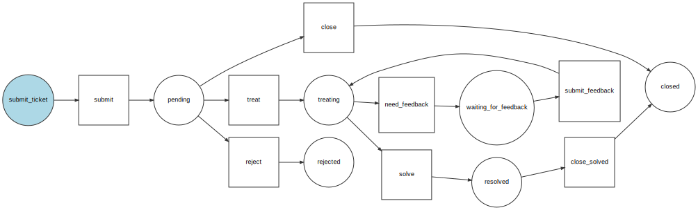

# Sndit

Sndit is a system design for package delivery tracking which can be used by small businesses and people who want to
understand software architecture.

**CAUTION**: This project is not yet used in real life so for small businesses some additional modifications may be needed.

Check the result https://sndit.io

for [API documentation](https://sndit.io/api/doc)

## Link Repository

This is a mobile app that is supposed to be used with this project

[Sndit Mobile App](https://github.com/vandetho/sndit-mobile)

## Sponsored by :

## Enhanced Entity Relationship (EER) Model

This section will provide you the visual representation of the relationships among the tables in the project model.

Coming Soon...

## Workflows

- Below is the package tracking workflow

- Below is the helpdesk ticketing workflow

## Documentation: 

For usage documentation, see:

[Installation](docs/installation.md)\
[Activate HTTP2/HTTP3 (QUIC) ](docs/http_2_or_quic.md)

See the bundled [LICENSE](LICENSE) file.